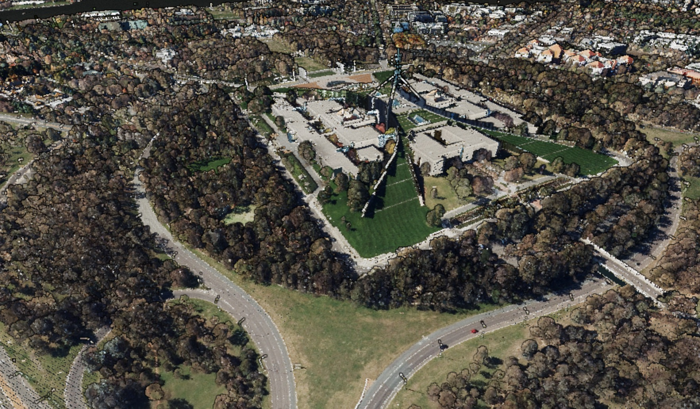
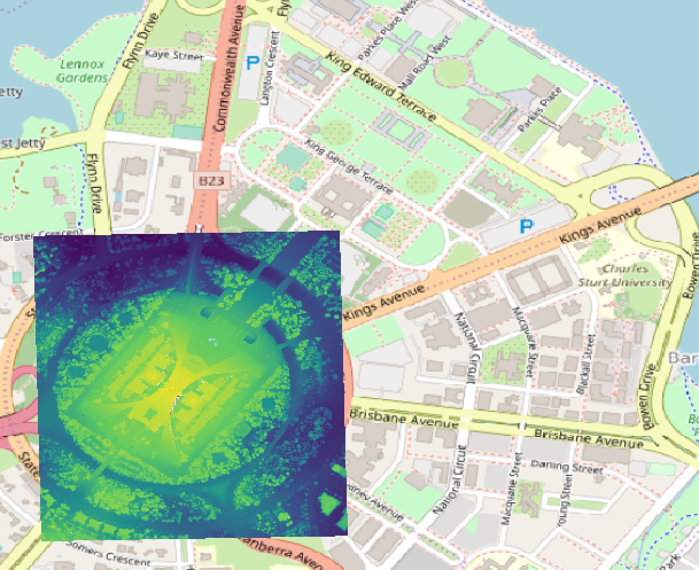

# Entwine - massive point cloud organisation

Entwine is an application which reorganises data into [https://en.wikipedia.org/wiki/Octree](octree) structures, using the Entwine Point Tile (EPT) format. The emerging specification is shown here:

https://github.com/connormanning/entwine/blob/master/doc/entwine-point-tile.md

EPT is intended to be a lossless 3D 'slippy map' tiling scheme for point clouds, which can be read into a viewer straight from storage (as for 2D map tiles).

## EPT or Potree?

Potree is an extremely popular format for creating point cloud octrees, based on the Potree Viewer being almost ubiquitous as the open source webGL based massive point cloud renderer. As of writing this workshop, Potree writes out only LAS 1.2 format 2 - or custom binary files. It is fast for visualisation, but not lossless. In order to **do** anything with the underlying data, you need to keep the original files **and** a potree index in hot storage.

Using EPT, the fundamental idea is that the octree becomes the 'hot' data, and the original LAS/LAZ tiles or flight swaths can be cold stored (or tape archived) - since both visualisation and data querying/analysis/product derivation can be handled from EPT.

Both formats create many very small files - which is OK for object storage, less good for moving data around.

## Creating an EPT resource

This is actually really easy using dockerised entwine. Taking our RPAS farm sample, try:

`docker run -it -v $(pwd):/opt/data connormanning/entwine -i /opt/data/APPF-ground-smrf-allthepoints.laz -o /opt/data/APPF-classified`

While that's running - entwine builds can also be configured with a simple JSON file, for example:

```
{
    "threads": 6,
    "reprojection": { "out": "EPSG:3857" }
}
```

...saved as `web-mercator.json` and run as:

`docker run -it -v $(pwd):/opt/data connormanning/entwine web-mercator.json -i /opt/data/APPF-ground-smrf-allthepoints.laz -o /opt/data/APPF-classified-webmercator`

...would run entwine using 6 threads, and reproject the index to web mercator (EPSG:3857).

Entwine configuration details, with ongoing discussion, can be found here: https://github.com/connormanning/entwine/blob/master/doc/entwine-point-tile.md

## Inspecting an EPT resource

An EPT resource can be inspected on the filesystem where it is created. Navigate to the output directory specified at entwine build time. For a single build you'll see `ept.json`, `ept-build.json` and directories named `ept-data`, `ept-hierarchy` and `ept-sources`.

- `ept.json` is familiar if you've seen `pdal info` results. It contains metadata about the extent of the dataset and its stored dimensions.
- `ept-build.json` holds some Entwine-specific build configuration data
- `ept-data` holds the point cloud data, with octree relationships prepended to file names
- `ept-hierarchy` holds a JSON file telling us how many points are stored in each node
- `ept-sources` holds PDAL readable metadata about each source file in the build

## viewing an EPT resource

Once you've created an Entwine index, start a web server in the directory you're working in:

`python -m ../resources/simplecorsserver.py 9001`

...and navigate to http://potree.entwine.io. Modify the URL to something like:

http://potree.entwine.io/custom.html?r=\"http://localhost:9001/dataset-entwine/\"

## reading an Entwine index with PDAL

*Note: this requires PDAL 1.8 with* `readers.ept`

A key motivation for using entwine is it's lossless data storage. Let's test that, and PDAL's entwine reader at the same time. So let's set up a pipeline to read our new local EPT resource and write out a LAZ file from the complete dataset:

```
{
  "pipeline": [
    {
      "type": "readers.ept",
      "filename": "ept://APPF-classified",
    },
    "back-from-entwine.laz"
  ]
}

```

Then use a PDAL command line to test the results:

`pdal diff APPF-ground-smrf-allthepoints.laz back-from-entwine.laz`

Did we make it?

## Scaling it upward

*Note: this requires PDAL 1.8 with* `readers.ept`

This workshop promised billions of points. So let's try that out using the ACT Government's 2015 LiDAR survey. It covers 1600 sqaure kilometres, and in total contains 30 billion points.

Point a web browser at: http://potree.entwine.io/data/custom.html?r="http://act2015-rgb-ept.s3.amazonaws.com/"

...and have an explore. Here's a screenshot from Parliament House:



We'll use this as a basis for an EPT data request, using the following pipeline:
```
{
  "pipeline": [
    {
      "type": "readers.ept",
      "filename": "http://act2015-8ppm-rgb-ept.s3.amazonaws.com/",
      "bounds": "([692769, 693616], [6090200,6091233])"
    },
    {
        "type":"writers.gdal",
        "resolution":1,
        "output_type":"idw",
        "filename":"/opt/data/act-dsm.tiff"
    }
  ]
}
```

Run this using docker:

```
docker run -ti -v $(pwd):/opt/data pdal/pdal pdal pipeline /opt/data/ept-remote.json
```


You can open the result in QGIS, set the CRS to EPSG:28355; and add an XYZ Tiles layer to render something like the following:



Your own, on demand DSM from a clipped region via a web request!

# Summary


[next - wrapping up](6-wrapup.md)
